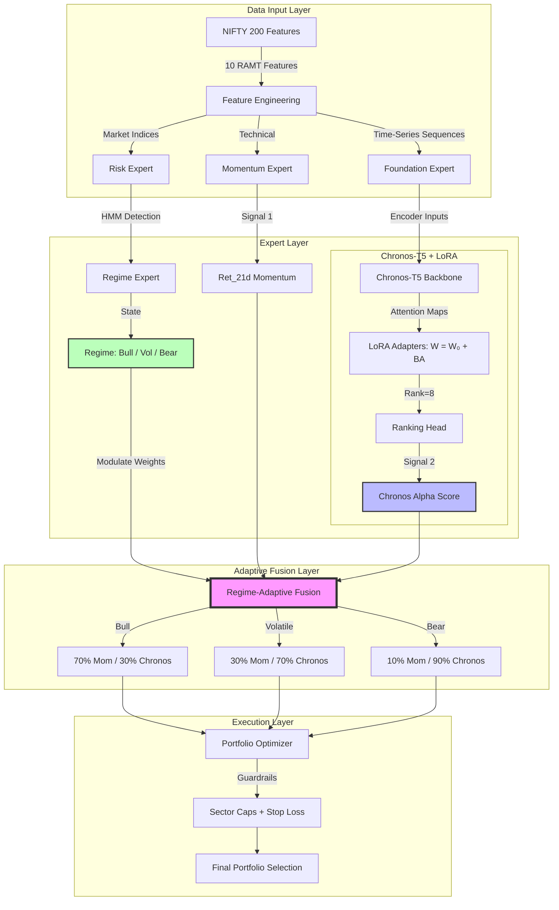

# Triple-Expert Hybrid System Architecture

This diagram illustrates the **Foundation-Hybrid** architecture implemented in Phase 3. It showcases the synergy between the Technical, Foundation, and Risk experts, modulated by a Regime-Adaptive Fusion mechanism.

### Key Components:
- **Technical Expert**: Provides the baseline trend-following momentum.
- **Foundation Expert**: Leverages the power of pre-trained time-series transformers (Chronos-T5) fine-tuned via Low-Rank Adaptation (LoRA) to capture non-linear alpha.
- **Risk Expert**: Uses a Hidden Markov Model (HMM) to detect market regimes and dynamically adjust the trust (weights) assigned to the Technical vs. Foundation experts.
